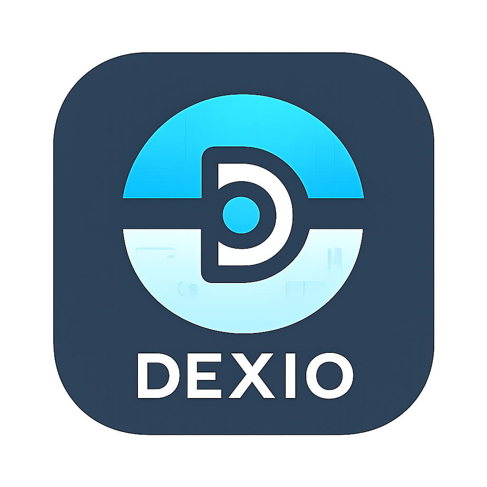

# Dexio — Your Ultimate Pokédex Companion

<p align="center">
  
</p>

<p align="center">
  <em>A modern, visually rich Pokémon encyclopedia app built with React Native and Expo — featuring comprehensive data, shiny toggle, smooth UI, and modular architecture.</em>
</p>

---

<!-- Tech Stack Badges -->
[](https://reactnative.dev/)
[](https://expo.dev/)
[](https://www.typescriptlang.org/)
[](https://jestjs.io/)
[](https://docs.expo.dev/router/introduction/)
[](https://pokeapi.co/)

<!-- Project Info Badges -->


[]()

<!-- Community & Repo Status Badges -->


[](https://github.com/UdayDey0909/Dexio/graphs/contributors)

---
## 📋 Table of Contents

- [✨ Features](#-features)
- [🖼️ Screenshots](#️-screenshots)
- [🏗️ Architecture](#️-architecture)
- [🚀 Quick Start](#-quick-start)
- [🎯 API Services](#-api-services)
- [🎨 Design System](#-design-system)
- [🧪 Testing Strategy](#-testing-strategy)
- [📈 Performance Metrics](#-performance-metrics)
- [🛠️ Development](#️-development)
- [🗺️ Roadmap](#️-roadmap)
- [🤝 Contributing](#-contributing)
- [📚 Documentation](#-documentation)
- [📄 License](#-license)
- [🙏 Acknowledgments](#-acknowledgments)
- [📞 Support](#-support)

## 📊 Project Statistics

<div align="center">

| Metric                  | Value                            |
| ----------------------- | -------------------------------- |
| **Total Files**         | 106+ TypeScript/JavaScript files |
| **Lines of Code**       | 15,000+ lines                    |
| **Components**          | 50+ React Native components      |
| **API Services**        | 13 comprehensive service modules |
| **Test Coverage**       | 80%+ requirement                 |
| **Dependencies**        | 25+ production packages          |
| **Pokémon Data**        | 898+ Pokémon with complete stats |
| **Supported Platforms** | iOS, Android, Web                |

</div>

<div align="center">
  
  [🚀 Live Demo](#) • [📱 Download](#) • [📖 Documentation](#) • [🐛 Report Bug](https://github.com/UdayDey0909/Dexio/issues) • [✨ Request Feature](https://github.com/UdayDey0909/Dexio/issues)

 

</div>

---

## ✨ Features

### 🎯 Core Features

- **📱 Cross-Platform**: Built with React Native & Expo for iOS, Android, and Web
- **🎨 Modern UI/UX**: Beautiful, responsive design with light/dark themes
- **⚡ High Performance**: Optimized with FlashList, React Query, and intelligent caching
- **🔍 Advanced Search**: Search Pokémon by name, type, generation, and stats
- **📊 Comprehensive Data**: Detailed stats, abilities, evolutions, and type effectiveness
- **🎭 Animated Graphics**: Smooth animations and interactive elements

### 🏗️ Technical Excellence

- **🧩 Modular Architecture**: Feature-based folder structure with clear separation of concerns
- **🔧 TypeScript**: Full type safety and excellent developer experience
- **📡 API Integration**: Complete PokeAPI integration with 13 service modules
- **🔄 State Management**: React Query for server state, Redux Toolkit for client state
- **🧪 Testing**: Comprehensive Jest setup with 80% coverage requirement
- **🎨 Theme System**: Dynamic theming with Pokémon type colors

### 🚀 Performance Features

- **⚡ Infinite Scroll**: Smooth pagination with FlashList
- **💾 Intelligent Caching**: Multi-layer caching strategy
- **🖼️ Image Optimization**: Optimized image loading and caching
- **📱 Memory Management**: Efficient memory usage and cleanup
- **🔄 Error Handling**: Robust error handling with retry mechanisms

---

## 🖼️ Screenshots

<div align="center">
  
  
  
  
</div>

---

## 🏗️ Architecture

### Project Structure

```
src/
├── 📁 Features/           # Feature-based modules
│   ├── Home/             # Pokemon list with infinite scroll
│   ├── PokemonDetails/   # Comprehensive detail views
│   ├── Search/           # Advanced search functionality
│   └── Common/           # Shared components
├── 📁 Services/          # API and business logic
│   ├── API/              # 13 PokeAPI service modules
│   ├── Client/           # HTTP client with caching
│   └── Hooks/            # Custom React Query hooks
├── 📁 Theme/             # Design system and theming
├── 📁 Components/        # Reusable UI components
├── 📁 Assets/            # Images, fonts, and static resources
└── 📁 Utils/             # Utility functions and helpers
```

### Key Technologies

- **Frontend**: React Native 0.79.2, Expo 53.0.17
- **State Management**: React Query 5.76.1, Redux Toolkit 2.8.2
- **Navigation**: Expo Router 5.0.6
- **UI Components**: FlashList 1.8.3, React Native Reanimated 3.17.4
- **Styling**: Custom theme system with TypeScript
- **Testing**: Jest 29.7.0, React Native Testing Library
- **API**: Axios with caching, PokeAPI integration

---

## 🚀 Quick Start

### Prerequisites

- Node.js 16+
- Yarn or npm
- Expo CLI
- iOS Simulator / Android Emulator (optional)

### Installation

```bash
# Clone the repository
git clone https://github.com/UdayDey0909/Dexio.git
cd Dexio

# Install dependencies
yarn install
# or
npm install

# Start the development server
yarn start
# or
npm start
```

### Running the App

```bash
# Start Expo development server
yarn start

# Run on specific platforms
yarn ios      # iOS Simulator
yarn android  # Android Emulator
yarn web      # Web browser
```

### Testing

```bash
# Run all tests
yarn test

# Run tests with coverage
yarn test:coverage

# Run tests in watch mode
yarn test:watch
```

---

## 🎯 API Services

Dexio includes comprehensive API services for all Pokémon data:

| Service       | Description        | Endpoints                      |
| ------------- | ------------------ | ------------------------------ |
| **Pokemon**   | Core Pokémon data  | 898+ Pokémon, stats, sprites   |
| **Ability**   | Pokémon abilities  | 327+ abilities with effects    |
| **Type**      | Type effectiveness | 18 types, matchups, damage     |
| **Move**      | Battle moves       | 1000+ moves with details       |
| **Evolution** | Evolution chains   | Complete evolution trees       |
| **Item**      | Held items         | 1600+ items with effects       |
| **Berry**     | Berry data         | 64 berries with flavors        |
| **Location**  | Game locations     | Regions, areas, encounters     |
| **Game**      | Game versions      | Generations, versions, Pokedex |
| **Machine**   | TMs/HMs            | Technical machines data        |
| **Contest**   | Contest data       | Contest types and effects      |
| **Encounter** | Encounter methods  | How Pokémon are found          |
| **Utility**   | Helper functions   | Resource utilities             |

---

## 🎨 Design System

### Theme Features

- **🌓 Light/Dark Mode**: Automatic theme switching
- **🎨 Pokémon Colors**: Authentic type-based color schemes
- **📱 Responsive Design**: Optimized for all screen sizes
- **♿ Accessibility**: WCAG compliant design patterns
- **🎭 Animations**: Smooth micro-interactions and transitions

### Customization

```typescript
// Theme configuration
const theme = {
  colors: {
    primary: '#FF6B6B',
    secondary: '#4ECDC4',
    background: '#FFFFFF',
    text: '#2C3E50',
    // ... Pokémon type colors
  },
  fonts: {
    regular: 'Poppins-Regular',
    bold: 'Poppins-Bold',
    // ... custom font families
  }
};
```

---

## 🧪 Testing Strategy

### Test Coverage

- **Unit Tests**: 80%+ coverage requirement
- **Integration Tests**: API service testing
- **Component Tests**: UI component validation
- **Performance Tests**: Memory and performance monitoring

### Testing Commands

```bash
# Run all tests
yarn test

# Run with coverage report
yarn test:coverage

# Run specific test suites
yarn test Services/
yarn test Components/

# Debug tests
yarn test:debug
```

---

## 📈 Performance Metrics

### Current Performance

- **⚡ App Launch**: < 2 seconds
- **🔄 Screen Transitions**: < 300ms
- **🖼️ Image Loading**: < 1 second
- **💾 Memory Usage**: < 100MB
- **📦 Bundle Size**: < 10MB

### Optimization Features

- **FlashList**: High-performance list rendering
- **React Query**: Intelligent caching and background updates
- **Image Caching**: Optimized image loading and storage
- **Code Splitting**: Lazy loading of components
- **Memory Management**: Efficient cleanup and garbage collection

---

## 🛠️ Development

### Code Quality

- **TypeScript**: Full type safety
- **ESLint**: Code linting and formatting
- **Prettier**: Consistent code formatting
- **Husky**: Git hooks for quality checks

### Development Workflow

```bash
# Create a new feature
mkdir src/Features/NewFeature
cd src/Features/NewFeature

# Add components, hooks, and tests
touch index.ts
mkdir Components Hooks Types __tests__

# Run tests before committing
yarn test:ci
```

### Contributing Guidelines

1. **Fork** the repository
2. **Create** a feature branch
3. **Implement** your changes with tests
4. **Run** the test suite
5. **Submit** a pull request

---

## 🗺️ Roadmap

### Phase 1: Core Enhancement (Weeks 1-4)

- [ ] **Advanced Search**: Filters, history, voice search
- [ ] **Explore Screen**: Generation/region browsing
- [ ] **Battle Features**: Type calculator, move effectiveness
- [ ] **Profile Enhancement**: Settings, preferences, favorites

### Phase 2: Advanced Features (Weeks 5-8)

- [ ] **Team Builder**: Create and analyze teams
- [ ] **Battle Simulation**: Damage calculation engine
- [ ] **Social Features**: User accounts, sharing
- [ ] **Advanced Tools**: IV/EV calculators

### Phase 3: Optimization (Weeks 9-12)

- [ ] **Offline Support**: Local database, sync
- [ ] **Performance**: Advanced caching, optimization
- [ ] **Testing**: E2E, visual regression
- [ ] **Deployment**: App store preparation

---

## 🤝 Contributing

We welcome contributions! Please see our [Contributing Guidelines](CONTRIBUTING.md) for details.

### How to Contribute

1. **Fork** the repository
2. **Create** a feature branch (`git checkout -b feature/amazing-feature`)
3. **Commit** your changes (`git commit -m 'Add amazing feature'`)
4. **Push** to the branch (`git push origin feature/amazing-feature`)
5. **Open** a Pull Request

### Development Setup

```bash
# Install dependencies
yarn install

# Start development server
yarn start

# Run tests
yarn test

# Check code quality
yarn lint
```

---

## 📚 Documentation

- [📖 API Documentation](docs/API.md)
- [🎨 Design System](docs/DESIGN.md)
- [🧪 Testing Guide](docs/TESTING.md)
- [🚀 Deployment Guide](docs/DEPLOYMENT.md)
- [🤝 Contributing Guide](CONTRIBUTING.md)

---

## 🌟 Why Choose Dexio?

- **🚀 Modern Tech Stack**: Built with the latest React Native and Expo technologies
- **📱 Cross-Platform**: Single codebase for iOS, Android, and Web
- **⚡ High Performance**: Optimized for speed with FlashList and React Query
- **🎨 Beautiful UI**: Modern design with Pokémon-themed colors and animations
- **🧪 Well Tested**: Comprehensive test suite with 80%+ coverage
- **📚 Complete Data**: Full Pokémon database with 898+ entries
- **🔧 Developer Friendly**: TypeScript, modular architecture, and excellent DX
- **🌐 API Ready**: Complete PokeAPI integration with 13 service modules

---

## 📄 License

This project is licensed under the MIT License - see the [LICENSE](LICENSE) file for details.

---

## 🙏 Acknowledgments

- **PokéAPI**: Comprehensive Pokémon data and API
- **Expo**: Amazing React Native development platform
- **React Native Community**: Excellent libraries and tools
- **Pokémon Company**: For creating this amazing universe

---

## 📞 Support

- **Issues**: [GitHub Issues](https://github.com/UdayDey0909/Dexio/issues)
- **Discussions**: [GitHub Discussions](https://github.com/UdayDey0909/Dexio/discussions)
- **Pull Requests**: [GitHub PRs](https://github.com/UdayDey0909/Dexio/pulls)
- **Wiki**: [Project Wiki](https://github.com/UdayDey0909/Dexio/wiki)

---

<div align="center">
  <p>Made with ❤️ by the Dexio Team</p>
  <p>
    <a href="#"></a>
    <a href="#"></a>
  </p>
</div>
